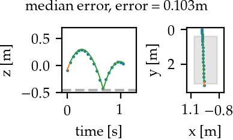
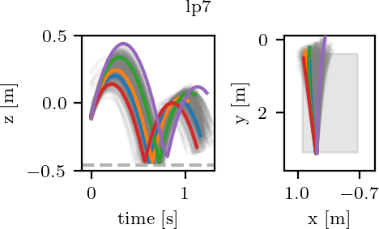
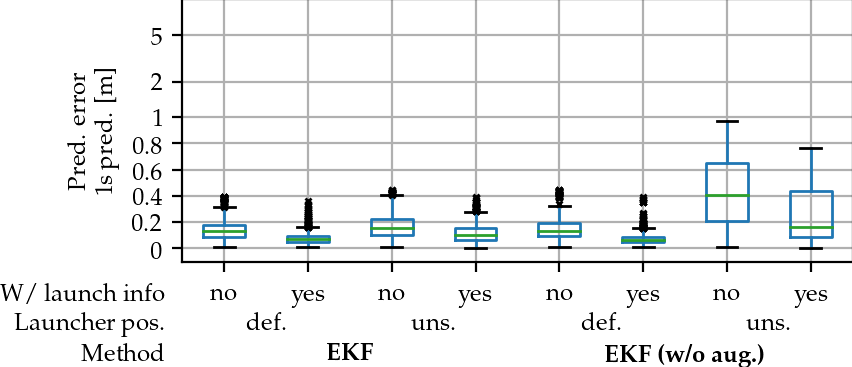
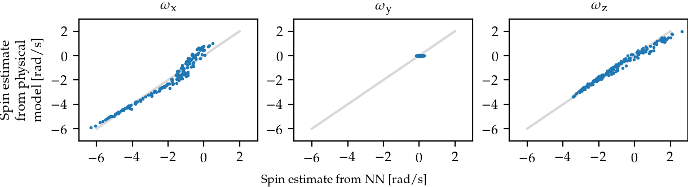

# Code for "Black-Box vs. Gray-Box: A Case Study on Learning Table Tennis Ball Trajectory Prediction with Spin and Impacts"


This repository contains code and evaluations for the table tennis ball tracking and prediction model presented in the paper "Black-Box vs. Gray-Box: A Case Study on Learning Table Tennis Ball Trajectory Prediction with Spin and Impacts", presented at the Learning for Dynamics and Control Conference (L4DC), 2023.

|  | 
|:--:| 
| *Median prediction error for 1s prediction is 10.3cm. Blue: Every 10th measurement, orange: filtered trajectory, green: predicted trajectory.* |

Achterhold, Jan and Tobuschat, Philip and Ma, Hao and Buechler, Dieter and Muehlebach, Michael and Stueckler, Joerg: \
**Black-Box vs. Gray-Box: A Case Study on Learning Table Tennis Ball Trajectory Prediction with Spin and Impacts**\
Learning for Dynamics and Control Conference (L4DC), 2023.

Paper: https://openreview.net/forum?id=OHv-vlgXQOv   
Paper with supplementary materials: https://arxiv.org/abs/2305.15189

If you use the code, data or models provided in this repository for your research, please cite our paper as:
```
@inproceedings{achterhold2023blackbox,
  title = {Black-Box vs. Gray-Box: A Case Study on Learning Table Tennis Ball Trajectory Prediction with Spin and Impacts},
  author = {Achterhold, Jan and Tobuschat, Philip and Ma, Hao and B{\"u}chler, Dieter and Muehlebach, Michael and Stueckler, Joerg},
  booktitle = {Proceedings of the Learning for Dynamics and Control Conference (L4DC)},
  year = {2023},
}
```

# 1. Install environment
We use PyTorch to implement our model, but found that GPU acceleration does not bring a significant advantage over running the model on GPU. 
However, this may depend on your specific hardware.
We use Python 3.9.

1. Update `pip`, install `wheel`
```
pip install --upgrade pip
pip install wheel
```
2. Install PyTorch 1.12.0 for CPU
```
pip install torch==1.12.0+cpu --extra-index-url https://download.pytorch.org/whl/cpu
```
3. Install remaining requirements
```
pip install -r requirements.txt
```

# 2. Download trajectory data

The table tennis ball trajectories used for training and evaluating the model are available for download. To download and extract the trajectory data, run
```
wget https://keeper.mpdl.mpg.de/f/75c1f43a17ae44f38130/?dl=1 -O trajectory_data.tgz
mkdir data/
tar xvz -f trajectory_data.tgz -C data/
```
See `archive-metadata.md` at https://keeper.mpdl.mpg.de/d/da55cfe1cafa4a40b6cd/ for licensing information of the trajectory data.

### Data format
Here, a description is given on the format of the HDF5 trajectory data files, in case you are interested in using the trajectory data in your own projects.
Recorded trajectory data is stored in HDF files.
Each trajectory is an HDF group within the HDF group `processed`, uniquely identified by a launcher orientation identifier (e.g., `lp7`) and a 4-digit number, separated by a '%' sign, i.e., `lp7%7000`, `lp7%7001`, etc.


The following launcher orientations are available: 
  - `lp7`: Trajectories from the 'default' launcher orientation
  - `lp7aug`: Augmented trajectories from the 'default' launcher orientation (see `data/generate_augmented.py`)
  - `lp9X`: Trajectories from the 'unseen' launcher orientation, with `lp9` aggregating all of them.

Each trajectory, e.g. `lp7%7000`, contains 4 datasets (numpy arrays) and two attributes.
The datasets are
  - `timestamps`: shape [T,], double\
    Timestamp in milliseconds when the measurement arrived at the measurement PC
    (NOT the time when the measurement was taken)
  - `frame_indices`: shape [T,], int\
    Integer index of the recording - gives the time the measurement was taken
    when multiplied with the sampling interval of 1/180Hz ~ 5.6ms
  - `positions`: shape [T,3], double\
    Position measurements
  - `side_info`: shape [7], double\
    Side information on the launch process.
    The fields are `rot_z_ccw_sin,rot_z_ccw_cos,phi,theta,top_left_motor,top_right_motor,bottom_motor`.
    The first two fields indicate the rotation of the launcher frame about the z axis, 
    `phi` is the actuation for the azimuthal angle of the launcher head ($s_\phi$ in the paper),
    `theta` is the actuation for the elevation angle of the launcher head ($s_\theta$ in the paper),
    and the remaining three fields are the motor actuations $s_{tl}, s_{tr}, s_{b}$.

The attributes are
  - `first_up_idx`: int\
    Integer index of the first measurement after an impact has happened.
    Impacts were detected with `data/impacts.py`.
  - `split`: str\
    Split assignment of the trajectory (train/test/val).


## Visualizations of the dataset
With the notebook at [ball_model/data/notebooks/visualization.ipynb](ball_model/data/notebooks/visualization.ipynb), visualizations of the datasets can be created (as shown below).
It also includes the fitting routine to map from actuation parameters $s_\phi$, $s_\theta$ to actual angles.

|  | 
|:--:| 
| *Visualizations of trajectories from the 'default' (lp7) launcher orientation. * |


# 3. Train or download models
You can either train the models yourself, or download pre-trained models from the internet.

## Training

### Train a single model
 - With launcher info
```
python -m ball_model.training.train_model_ekf --id=model_ekf_g_lp7aug_sialways_s1 with ekf_default_args use_side_info=always seed=1 
```
 - Without launcher info
```
python -m ball_model.training.train_model_ekf --id=model_ekf_g_lp7aug_sinever_s1 with ekf_default_args use_side_info=never seed=1 
```

### Train model ablations
To train different ablations, e.g., on augmented/non-augmented data and (not) using launcher info, on 10 seeds, see [jobs/github_ekf/train/generate_training_jobs_ekf.py](jobs/github_ekf/train/generate_training_jobs_ekf.py), which generates [jobs/github_ekf/train/train_jobs_ekf.txt](jobs/github_ekf/train/train_jobs_ekf.txt). This file contains jobs you can run in parallel, e.g. with your favorite job scheduling tool.

### Run evaluation on trained models
Run all commands in [jobs/github_ekf/eval/eval_jobs_ekf.txt](jobs/github_ekf/eval/eval_jobs_ekf.txt) (can be run in parallel).

## Download trained models
Trained models, on all ablations, including their evaluations, can be obtained with
```
wget https://keeper.mpdl.mpg.de/f/59bca95996984bed8aac/?dl=1 -O trained_models.tgz
mkdir experiments
tar xvz -f trained_models.tgz -C experiments
```
Note that the archive file above is 9.8 GB large.
See `archive-metadata.md` at https://keeper.mpdl.mpg.de/d/da55cfe1cafa4a40b6cd/ for information on licensing of the trained models.

# 4. Generate plots
After either training and evaluating all model ablations, or downloading trained models from the internet, you can generate the plots presented in the paper.

* Run the notebook at [ball_model/evaluation/notebooks/prediction_performance.ipynb](ball_model/evaluation/notebooks/prediction_performance.ipynb) to generate plots on the prediction performance.
  
|  | 
|:--:| 
| *Comparison of prediction error (1s prediction) for different EKF methods.* |

* Run the notebook at [ball_model/evaluation/notebooks/spin_evaluation.ipynb](ball_model/evaluation/notebooks/spin_evaluation.ipynb) to validate the physical plausibility of predicted spins.

|  | 
|:--:| 
| *Correlation of spins predicted by the neural network and spins from the physical model. * |

# Run the filter once
For an example on how to run the filter, see [ball_model/filter/run_filter.py](ball_model/filter/run_filter.py).

# Additional tools
For computational performance, we manually implemented gradients of the EKF.
The script at [ball_model/differentiable_simulator/gradcheck.py](ball_model/differentiable_simulator/gradcheck.py) checks their validity.


# Code license
See [LICENSE](LICENSE).
